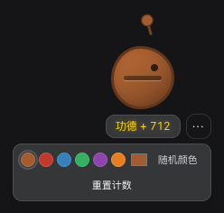

# @deepseek-ai/dsh-client-ui-muyu

[English](README.md) | 中文

  

一个赛博木鱼 —— 悬浮在 Web 窗口里的木鱼小摆件，工作间隙敲一敲、攒一攒"功德"。

点击木鱼即敲击，鼠标按住木鱼移动可随意拖拽，刷新页面不丢进度，其他的留给大家自由探索～

## 使用提示

木鱼首次出现在窗口右下角。如果打开后没看到木鱼，可能是被其他悬浮面板或插件遮挡——可以暂时关闭遮挡它的面板，把木鱼拖到无遮挡区域，再重新打开原面板。

拖拽松开后消失同样可能被遮挡，此时需要您努力找回失踪的木鱼(´▽｀)

## 已知限制与后续

- **没有声音** —— 真木鱼会"笃"地一响，本插件刻意保持安静。
- **功德数、位置与颜色按浏览器保存** —— 数据在 `localStorage` 而非会话日志中，换台机器/换个浏览器会重新开始。
